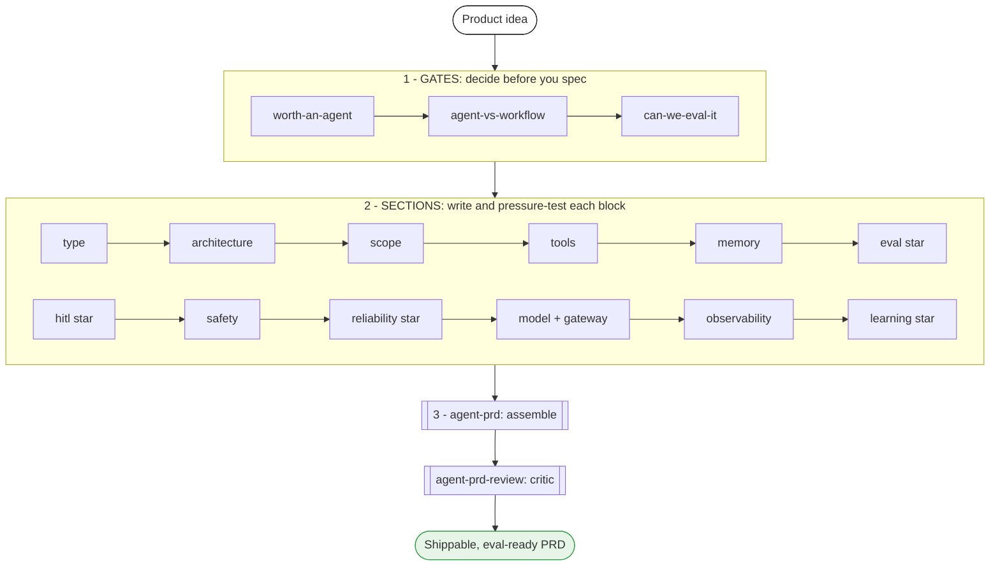
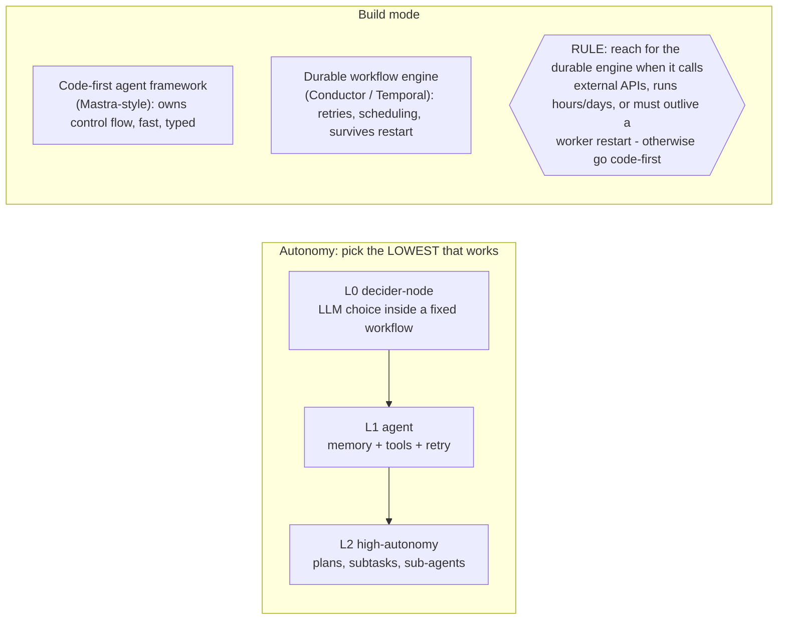
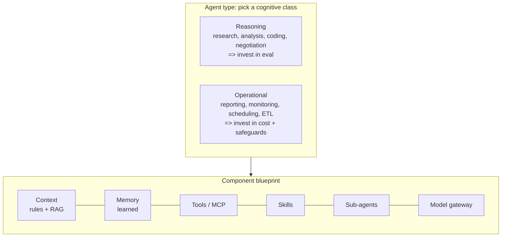
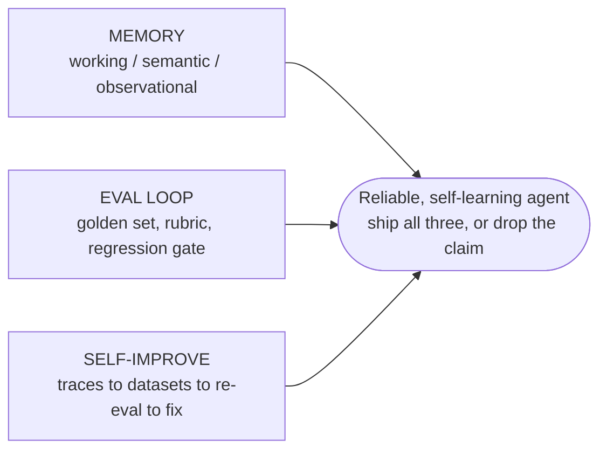

# agent-blueprint

**The reliable-agent playbook for product managers.**

> Your agent won't die in production because the spec skipped the hard parts.

**Live → [Learn &amp; Build Agents](https://mothivenkatesh.github.io/agent-blueprint/)** · pick an idea in [idea-box](https://mothivenkatesh.github.io/idea-box/web/), then spec it here.

Teams have great frameworks for *building* agents and almost no method for *deciding what to
build* and speccing it so it survives. So agents ship that should have been workflows, with no
eval plan, no autonomy boundary, and no failure plan, and a large share get scrapped in
production. `agent-blueprint` fixes the spec, not the code.

Think of it this way: **the frameworks are the power tools; this is the blueprint and the
building code.** You can own the best tools and still build a house that collapses.

It is two things at once:
- a **playbook** — read [`CLAUDE.md`](./CLAUDE.md) to learn *how* to spec a reliable agent;
- a **skill pack** — 18 Claude Code skills that *do it with you*, section by section.

Every recommendation is grounded in a word-by-word read of the field's best production sources:
the **Orkes Conductor** blog (165 posts), the **"Principles of Building AI Agents"** book
(Sam Bhagwat / Mastra, 3rd ed), **Mastra's** blog + agent-memory research (199 posts), and
**Antigma's `ante`** docs + **Lyzr's** agent-type taxonomy. The distilled evidence ships in
[`references/`](./references).

> For [a PM or founder specifying an AI agent] who [can't turn the idea into a spec that
> survives production], **agent-blueprint** is a [framework-agnostic, reliable-agent playbook]
> that [forces the five decisions agent projects die without: eval, autonomy, memory, failure,
> and learning]. Unlike [frameworks that build but don't decide, and generic AI-PRD templates
> that skip agent reliability], it is distilled from the field and installs as 18 skills.

> Not affiliated with Orkes, Mastra, Antigma, or Lyzr. An independent distillation of their
> public work into a PM-facing playbook, with sources cited throughout.

---

## Why this exists

Most "agent PRDs" are normal PRDs with the word *agent* sprinkled in. They cannot answer the
five questions that decide whether an agent ships and survives:

1. **How will we know it works?** (eval plan)
2. **What can it do without a human?** (autonomy + HITL boundaries)
3. **What does it remember?** (memory strategy)
4. **How does it fail, and how does it degrade?** (reliability + failure premortem)
5. **How does it get better over time?** (self-learning loop)

Everyone else sells the build, the list, or a blog. Nobody owns the decision layer:

| What exists | What it does | What it misses |
|---|---|---|
| Frameworks (LangGraph, Mastra, CrewAI) | Build the agent | Don't tell you whether to, what type, or how reliable |
| Awesome-lists | Link to things | No method |
| Skill marketplaces (millions of skills) | Task skills | No coherent reliability playbook |
| AI-PRD generators | Generic or codegen PRDs | Skip the agent-specific sections |
| Production checklists (Anthropic, LangChain) | Authoritative advice | Fragmented, engineer-facing, vendor-locked |

`agent-blueprint` is the one thing that is **a decision/spec layer + PM-facing +
framework-agnostic + multi-source-distilled + forces the five sections + installable.** Each
rival has one or two of those. None has all six.

## The pipeline



*Editable Excalidraw source: [`docs/diagrams/01-pipeline.excalidraw`](./docs/diagrams/01-pipeline.excalidraw)*

## The first decision: do you even need an agent?



*Editable Excalidraw source: [`docs/diagrams/02-autonomy-build-mode.excalidraw`](./docs/diagrams/02-autonomy-build-mode.excalidraw)*

The most-repeated lesson across every source: **default to the least autonomy that works.**
One LLM step inside a deterministic workflow beats an autonomous agent until proven otherwise.

**Picking a builder for that workflow or agent?** See the companion
[**Agentic Workflow Builder Comparison**](https://mothivenkatesh.github.io/agentic-workflow-builder-comparison/) —
a layered look at 9 tools (Activepieces, n8n, Dify, Flowise, Lyzr, CrewAI, LangGraph, Orkes,
Temporal). It reaches the same conclusion as this playbook: **choose by layer first, not by
feature checklist.**

## Agent architecture & types

Classify the agent's production type, then blueprint its components.



*Editable Excalidraw source: [`docs/diagrams/04-architecture-and-types.excalidraw`](./docs/diagrams/04-architecture-and-types.excalidraw)*

## What makes it different

| | Decide before you build | Force the 5 sections everyone skips | Evidence, not vibes |
|---|---|---|---|
| **Value** | Kill the wrong idea early: is it worth an agent? agent or workflow? can we even measure it? | Eval, HITL, memory, failure premortem, learning loop — made non-optional | Framework-agnostic, distilled from the field, with sources |
| **Proof** | 3 hard kill-gates; ~40% of agentic projects scrapped by 2027 (Gartner) | The eval gate refuses to proceed without a rubric; the critic rejects a PRD missing any of the five | Word-by-word read of ~550 production sources, cited in `references/` |
| **Pain it kills** | Building an agent that should have been a script | Agents that regress while returning 200 OK; no autonomy line; no failure plan | Trusting a generic template or one vendor's blog |

A framework can't claim column 1 (it builds). A generic PRD tool can't claim column 2 (it never
kills an idea). A vendor checklist can't claim column 3 (it's locked to one stack).

## The 18 skills

Namespaced as `/agent-blueprint:<skill>` once installed. ★ = the differentiator sections most
agent PRDs skip.

| Layer | Skill | What it does |
|---|---|---|
| **Gate** | `worth-an-agent` | Is an agent the cheapest tool that works, vs a workflow / script / nothing? |
| **Gate** | `agent-vs-workflow` | Autonomy level + build mode (code-first vs durable engine vs hybrid) |
| **Gate** | `can-we-eval-it` | Can success be measured? If not — stop. (hard kill-gate) |
| **Section** | `agent-type` | Reasoning vs Operational + named production category + topology |
| **Section** | `agent-architecture` | Component blueprint: context · memory · tools · MCP · skills · sub-agents · gateway |
| **Section** | `scope-and-topology` | Capabilities, non-goals, single vs multi-agent shape |
| **Section** | `tool-spec` | Tools, integrations, data access, I/O schemas, MCP, idempotency |
| **Section** | `memory-spec` | working vs semantic-recall vs observational vs none |
| **Section** | `eval-plan` ★ | Golden dataset, LLM-as-judge rubric, thresholds, regression gate |
| **Section** | `hitl-and-autonomy` ★ | Where a human approves; approval vs suspension; autonomy boundaries |
| **Section** | `safety-and-guardrails` | Prompt-injection / PII / RBAC / secrets / sandbox / spend caps |
| **Section** | `reliability-and-failure` ★ | Retries / timeouts / idempotency / compensation + a failure premortem |
| **Section** | `model-and-cost` | Model tiering, fallback chain, token/latency budget, unit economics |
| **Section** | `model-gateway` | Provider routing, virtual-key budgets, BYOK, fail-closed (control plane) |
| **Section** | `observability-and-ops` | Tracing, metrics, drift, rollout, versioning, governance |
| **Section** | `learning-loop` ★ | How it improves: traces -> datasets -> re-eval -> fix |
| **Spine** | `agent-prd` | Orchestrator: runs the gates, drives the sections, assembles the doc |
| **Spine** | `agent-prd-review` | Critic: audits any agent PRD against the rubric -> a scorecard |

## What makes an agent "self-learning"



*Editable Excalidraw source: [`docs/diagrams/03-self-learning-trio.excalidraw`](./docs/diagrams/03-self-learning-trio.excalidraw)*

"Self-learning" is not a magic module. It is three sections working together — memory (it
remembers), an eval loop (it is measured), and a self-improve loop (production traces become new
eval cases that drive fixes). Ship all three or do not make the claim.

## How to use

### Install

```bash
/plugin marketplace add mothivenkatesh/agent-blueprint
/plugin install agent-blueprint@agent-blueprint
```

(Local dev: `/plugin marketplace add /absolute/path/to/agent-blueprint`, install, then `/reload-plugins`.)

### Two entry points

```text
/agent-blueprint:agent-prd          # draft a full agent PRD from an idea (the orchestrator)
/agent-blueprint:agent-prd-review   # audit an existing agent PRD -> a scorecard (zero setup)
```

The fastest way to feel the value: run `agent-prd-review` on a spec you already have. Zero setup,
and you get a section-by-section Agent PRD Scorecard you can share with your team.

### Typical flow

1. `agent-prd` interviews you (problem, the perfect run, anger triggers, stakes).
2. It runs the three **gates** and stops if any kills the idea (e.g. it should be a workflow).
3. It walks the **sections**, forcing each decision and citing `references/` for defaults.
4. It assembles a 16-section PRD with requirement IDs and acceptance criteria.
5. `agent-prd-review` audits the result and flags anything missing.

See a full worked example: [`examples/refund-resolution-agent-prd.md`](./examples/refund-resolution-agent-prd.md).

## What it is, and isn't

- It **specs and decides**; it does not run a single line of agent code. Use it *with* a
  framework, not instead of one.
- It is **best-in-class for its layer** (the reliable-agent spec), not "the most powerful agent
  repo" — that framing is for builders, and builders are a different category.
- It is **young** (v0.2). Differentiated by design; unproven by adoption. Issues and PRs welcome.

## How it's built

- **Shared context:** [`CLAUDE.md`](./CLAUDE.md) — prime directives + per-skill do's & don'ts,
  inherited by every skill. The playbook in one file.
- **Skills:** [`skills/`](./skills) — 18 lean `SKILL.md` files; each opens with a pointer to
  `CLAUDE.md` (progressive disclosure keeps context cost low).
- **Evidence (the moat):** [`references/`](./references)
  - `skill-evidence-map.md` — Orkes reliability / HITL / governance canon
  - `gap-closed-synthesis.md` — Mastra memory + eval + self-improve canon
  - `book-code.md` — verbatim code recovered from the *Principles* ebook
  - `antigma-lyzr-architecture.md` — Antigma `ante` architecture + Lyzr agent-type taxonomy
- **Diagrams:** [`docs/diagrams/`](./docs/diagrams) — editable `.excalidraw` sources +
  `build_diagrams.py`. Rendered inline as Mermaid so they display on GitHub.

```
agent-blueprint/
├── CLAUDE.md                  the playbook (prime directives + per-skill do's/don'ts)
├── README.md                  you are here
├── .claude-plugin/            plugin.json + marketplace.json
├── skills/                    18 SKILL.md files (gates, sections, spine)
├── references/                the distilled evidence (the moat)
├── examples/                  a full worked agent PRD
└── docs/diagrams/             editable Excalidraw sources + generator
```

## Cross-agent

Skills follow the open Agent Skills standard, so the same Markdown also runs in Cursor, Copilot,
and other agents — not Claude Code only.

## Freshness

Model IDs and API names in `references/` are a **March-2026 snapshot**. This field moves monthly;
re-verify before quoting a specific model string in a live PRD. The plugin version bumps when the
references are refreshed.

## Status

v0.2 — all 18 skills shipped (gates + section-writers + orchestrator + critic). Roadmap: a
trigger-accuracy eval of the pack itself, hand-drawn diagram PNGs, and an npm installer for
one-command cross-agent install.

## Related & further reading

`agent-blueprint` is one piece of a wider set of agentic + product tooling:

- **[Agentic Workflow Builder Comparison](https://mothivenkatesh.github.io/agentic-workflow-builder-comparison/)** — the companion to this playbook. Once `agent-vs-workflow` tells you the build mode, this compares 9 builders by architectural layer (no-code platforms → frameworks → durable-execution engines).
- **[MStack](https://github.com/mothivenkatesh/MStack)** — the Claude Code marketplace this method grew out of: agentic GTM, Growth, and Product skills (multiple plugins, 190+ skills).
- **[lean-engineering-skills](https://github.com/mothivenkatesh/lean-engineering-skills)** — 11 Claude Code skills for building stable systems without bloat. The engineering-discipline complement to this spec layer.
- **[cortex](https://github.com/mothivenkatesh/cortex)** — an AI agent framework (workflows, agents, tools, self-healing) for when you are ready to *build* what you spec'd here.
- **[claude-academy](https://github.com/mothivenkatesh/claude-academy)** — a Duolingo-style app to go from Claude enthusiast to architect.

## Credits

Built by [Mothi Venkatesh](https://github.com/mothivenkatesh). Distilled from the public work of
**Orkes** (orkes.io), **Mastra / Sam Bhagwat** (*Principles of Building AI Agents*, mastra.ai),
**Antigma** (ante.run), and **Lyzr** (lyzr.ai). The engineering ideas are theirs; this repo is
the PM-facing playbook on top.

## License

MIT — see [LICENSE](./LICENSE).
