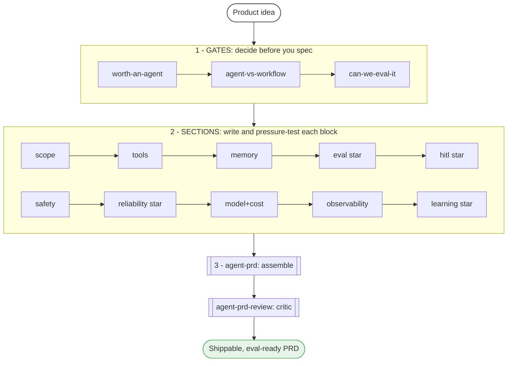
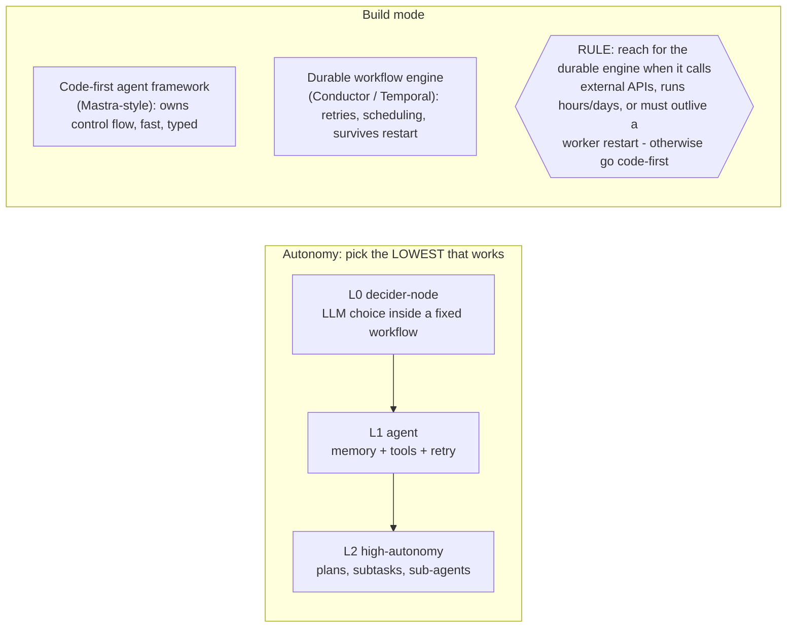

# agent-builder

**The reliable-agent playbook for product managers.** A Claude Code skill pack that turns a
product idea into a *shippable* Agentic AI PRD — including the five things a generic PRD
template always misses: an **eval plan**, **human-in-the-loop boundaries**, a **memory
strategy**, a **reliability + failure premortem**, and a **self-learning loop**.

It is two things at once:
- a **playbook** — read `CLAUDE.md` and this README to learn *how* to spec a reliable agent;
- a **skill pack** — 15 Claude Code skills that *do it with you*, section by section.

Every recommendation is grounded in a full, word-by-word read of three sources: the
**Orkes Conductor** engineering blog (165 posts), the **"Principles of Building AI Agents"**
book (Sam Bhagwat / Mastra, 3rd ed), and the **Mastra** blog + agent-memory research
(199 posts). The distilled evidence ships in [`references/`](./references).

> Not affiliated with Orkes or Mastra. This is an independent distillation of their public
> material into a PM-facing playbook, with sources cited throughout.

---

## The pipeline



*Editable Excalidraw source: [`docs/diagrams/01-pipeline.excalidraw`](./docs/diagrams/01-pipeline.excalidraw)*

---

## Why this exists

Most "agent PRDs" are normal PRDs with the word *agent* sprinkled in. They cannot answer the
five questions that decide whether an agent actually ships and survives production:

1. **How will we know it works?** (eval plan)
2. **What can it do without a human?** (autonomy + HITL boundaries)
3. **What does it remember?** (memory strategy)
4. **How does it fail, and how does it degrade?** (reliability + failure premortem)
5. **How does it get better over time?** (self-learning loop)

`agent-builder` forces a PM to answer all five, with evidence-backed defaults instead of vibes,
and kills agent ideas that should have been a plain workflow.

---

## The first decision: do you even need an agent?



*Editable Excalidraw source: [`docs/diagrams/02-autonomy-build-mode.excalidraw`](./docs/diagrams/02-autonomy-build-mode.excalidraw)*

The single most-repeated lesson across all three sources: **default to the least autonomy
that works.** One LLM step inside a deterministic workflow beats an autonomous agent until
proven otherwise — "the AI can be wrong, the workflow never is."

---

## The 15 skills

Namespaced as `/agent-builder:<skill>` once installed. ★ = the differentiator sections most
agent PRDs skip.

| Layer | Skill | What it does |
|---|---|---|
| **Gate** | `worth-an-agent` | Is an agent the cheapest tool that works, vs a workflow / script / nothing? |
| **Gate** | `agent-vs-workflow` | Autonomy level + build mode (code-first vs durable engine vs hybrid) |
| **Gate** | `can-we-eval-it` | Can success be measured? If not — stop. (hard kill-gate) |
| **Section** | `scope-and-topology` | Capabilities, non-goals, single vs multi-agent shape |
| **Section** | `tool-spec` | Tools, integrations, data access, I/O schemas, MCP, idempotency |
| **Section** | `memory-spec` | working vs semantic-recall vs observational vs none |
| **Section** | `eval-plan` ★ | Golden dataset, LLM-as-judge rubric, thresholds, regression gate |
| **Section** | `hitl-and-autonomy` ★ | Where a human approves; approval vs suspension; autonomy boundaries |
| **Section** | `safety-and-guardrails` | Prompt-injection / PII / RBAC / secrets / sandbox / spend caps |
| **Section** | `reliability-and-failure` ★ | Retries / timeouts / idempotency / compensation + a failure premortem |
| **Section** | `model-and-cost` | Model tiering, fallback chain, token/latency budget, unit economics |
| **Section** | `observability-and-ops` | Tracing, metrics, drift, rollout, versioning, governance |
| **Section** | `learning-loop` ★ | How it improves: traces -> datasets -> re-eval -> fix |
| **Spine** | `agent-prd` | Orchestrator: runs the gates, drives the sections, assembles the doc |
| **Spine** | `agent-prd-review` | Critic: audits any agent PRD against the rubric -> a scorecard |

---

## What makes an agent "self-learning"


*Editable Excalidraw source: [`docs/diagrams/03-self-learning-trio.excalidraw`](./docs/diagrams/03-self-learning-trio.excalidraw)*

"Self-learning" is not a magic module. It is three sections working together — **memory**
(it remembers), an **eval loop** (it is measured), and a **self-improve** loop (production
traces become new eval cases that drive fixes). Ship all three or do not make the claim.
The only still-frontier piece is automated prompt/tool rewrite — that stays human-in-the-loop
today, and the playbook says so honestly.

---

## How to use

### Install

```bash
/plugin marketplace add mothivenkatesh/agent-builder
/plugin install agent-builder@agent-builder
```

(For local development: `/plugin marketplace add /absolute/path/to/agent-builder`, install,
then `/reload-plugins`.)

### Two entry points

```text
/agent-builder:agent-prd          # draft a full agent PRD from an idea (the orchestrator)
/agent-builder:agent-prd-review   # audit an existing agent PRD -> a scorecard (zero setup)
```

The fastest way to feel the value: run `agent-prd-review` on a spec you already have. It works
with no setup and returns a section-by-section Agent PRD Scorecard you can share with your team.

### Typical flow

1. `agent-prd` interviews you (problem, the perfect run, anger triggers, stakes).
2. It runs the three **gates** and stops if any kills the idea (e.g. it should be a workflow).
3. It walks the **sections**, forcing each decision and citing `references/` for defaults.
4. It assembles a 13-section PRD with requirement IDs and acceptance criteria.
5. `agent-prd-review` audits the result and flags anything missing.

You can also call any single skill directly, e.g. `/agent-builder:eval-plan` to write just the
evaluation section.

---

## How it's built

- **Shared context:** [`CLAUDE.md`](./CLAUDE.md) — prime directives + per-skill do's & don'ts,
  inherited by every skill. This is the playbook in one file.
- **Skills:** [`skills/`](./skills) — 15 lean `SKILL.md` files; each opens with a pointer to
  `CLAUDE.md` (progressive disclosure keeps context cost low).
- **Evidence (the moat):** [`references/`](./references)
  - `skill-evidence-map.md` — Orkes reliability / HITL / governance canon
  - `gap-closed-synthesis.md` — Mastra memory + eval + self-improve canon
  - `book-code.md` — verbatim code recovered from the *Principles* ebook
- **Diagrams:** [`docs/diagrams/`](./docs/diagrams) — editable `.excalidraw` sources +
  `build_diagrams.py` to regenerate them. The README renders them inline as Mermaid so they
  display on GitHub; open the `.excalidraw` files in [excalidraw.com](https://excalidraw.com)
  to edit the hand-drawn versions.

```
agent-builder/
├── CLAUDE.md                  the playbook (prime directives + per-skill do's/don'ts)
├── README.md                  you are here
├── .claude-plugin/            plugin.json + marketplace.json
├── skills/                    15 SKILL.md files (gates, sections, spine)
├── references/                the distilled evidence (the moat)
└── docs/diagrams/             editable Excalidraw sources + generator
```

## Cross-agent

Skills follow the open Agent Skills standard, so the same Markdown also runs in Cursor,
Copilot, and other agents — not Claude Code only.

## Freshness

Model IDs and API names in `references/` are a **March-2026 snapshot**. This field moves
monthly; re-verify before quoting a specific model string in a live PRD. The plugin version
bumps when the references are refreshed.

## Status

v0.1 — all 15 skills shipped. Roadmap: a worked example PRD, a trigger-accuracy eval, and an
npm installer for one-command cross-agent install.

## Credits

Built by [Mothi Venkatesh](https://github.com/mothivenkatesh). Distilled from the public work
of **Orkes** (orkes.io/blog) and **Mastra / Sam Bhagwat** (*Principles of Building AI Agents*,
mastra.ai). All credit for the underlying engineering ideas is theirs; this repo is the
PM-facing playbook on top.

## License

MIT — see [LICENSE](./LICENSE).
